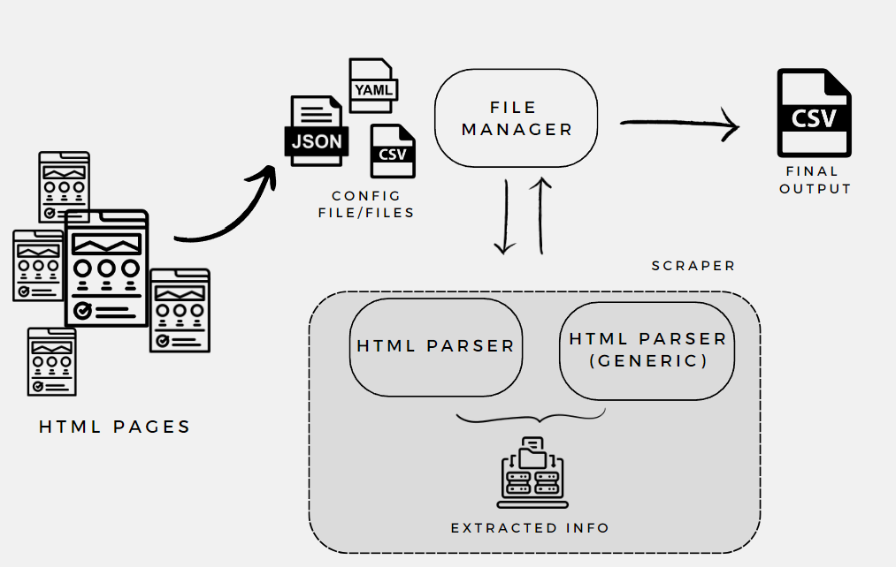

# Python-Scraping-Hands-On
<div style="text-align: center;">


</div>

## Beschreibung
Das "Python-Scraping-Hands-On"
Projekt ist eine umfassende Lernressource für Studierende, welche die Grundlagen und 
fortgeschrittenen Techniken des Web Scraping mit Tools wie Selenium, BeautifulSoup, 
Newspaper3K und Pandas kennenlernen möchten. Das Projekt demonstriert einen modularen 
Ansatz zur Entwicklung eines Web-Scrapers und bietet praktische Beispiele für das Scraping 
verschiedener Webseiten.

## Projektstruktur

<div style="text-align: center">


</div>

project/
├── input/                     # Eingabedaten
│   ├── urls.json              # Konfigurationsdatei für URLs
│   ├── urls.csv               # Alternative Konfigurationsdatei im CSV-Format
├── output/                    # Ausgabedaten
│   ├── ....csv                # Gespeicherte Ergebnisse des Scrapings
│   
├── templates/                 # HTML-Templates
│   └── beispiel.html          # Beispiel-Script für JavaScript DOM-Manipulation
├── img/                       # Bilder für das README
│   └──x.png                   # Projektübersichtsbild
├── src/                       # Quellcode
│   ├── parser/                # Parser-Module
│   │   ├── generic_html_parser.py # Behandelt JavaScript-basierte Inhalte und Paginierung
│   │   ├── html_parser.py     # Zentraler Parser für HTML-Inhalte
│   │   
│   ├── utils/                 # Hilfsfunktionen und Werkzeuge
│   │   ├── file_manager.py    # Lesen und Schreiben von Dateien (z. B. Konfiguration und Ergebnisse)
│   │   
│   │ 
│   └── config.py              # Projektkonfigurationsdateien
├── main.py                    # Einstiegspunkt des Projekts
├── README.md                  # Dokumentation des Projekts
└── requirements.txt           # Abhängigkeiten des Projekts


- **img/:** Enthält Bilder für das README.
- **output/:** Verzeichnis, in dem gescrapte Inhalte als CSV-Dateien gespeichert werden.
- **parser/:
generic_html_parser.py:** Behandelt die Extraktion von Daten aus dynamisch geladenen Webseiten. Verwendet Selenium, um mit JavaScript-basierten Inhalten umzugehen und paginierte Inhalte zu scrapen.
- **html_parser.py:** Zentraler Parser für HTML-Inhalte. Nutzt BeautifulSoup für das Parsen von HTML, Newspaper3K für das Extrahieren von Artikelinhalten und Pandas für das Lesen von Tabellen.
- **templates/:
beispiel.html:** Ein HTML-Script, das zeigt, wie JavaScript DOM-Elemente manipulieren kann.
- **config.py:** Enthält Konfigurationseinstellungen für das Projekt, wie Pfade und Einstellungen für das Lesen/Schreiben von Dateien.
- **file_manager.py:** verantwortlich für das Lesen der Konfigurationsdateien (urls.json/csv) und das Speichern der Ergebnisse. Konvertiert Konfigurationsdaten in nutzbare Formate und exportiert gescrapte Daten in CSV-Dateien.
- **main.py:** Hauptskript, das den gesamten Scraping-Prozess orchestriert. Ruft Funktionen der anderen Module auf und steuert den Datenfluss.
urls.json/csv: Konfigurationsdateien zur Demonstration des Scrapings mehrerer Webseiten.


## Abhängigkeiten
Das Projekt verwendet folgende Pakete:

- **Selenium:** Ermöglicht die Automatisierung von Webbrowsern, nützlich für das Scraping von dynamischen Inhalten.
- **BeautifulSoup4:** Bibliothek zum Parsen von HTML und XML Dokumenten. Wird für das Extrahieren von Daten aus statischen Webseiten verwendet.
- **Requests:** Einfache HTTP-Bibliothek für Python. Wird für den Abruf von Webseiten genutzt.
- **Pandas:** Datenanalyse-Bibliothek, die unter anderem zum Lesen und Schreiben von Daten in verschiedenen Formaten wie CSV, Excel usw. verwendet wird.
- **Newspaper3k:** Spezialisiert auf das Extrahieren von Artikelinhalten und -daten, nützlich für das Sammeln von Nachrichtenartikeln.
- **WebDriver-Manager:** Hilft beim Management der Browser-Treiber für Selenium.
- **Loguru:** Erweiterte Logging-Bibliothek, welche das Logging vereinfacht.
- **Python-Dateutil:** Bietet leistungsstarke Erweiterungen zum Standard datetime Modul.
- **Black, iSort, Pylint:** Werkzeuge zur Codeformatierung und Qualitätskontrolle.
- **HTML5lib:** Ein kompatibler HTML5-Parser, der in Kombination mit BeautifulSoup verwendet wird.
- **NumPy:** Grundlegende Paket für wissenschaftliche Berechnungen in Python.

## Konfigurationsdateien (urls.json und urls.csv)
Das Projekt verwendet zwei Formate von Konfigurationsdateien: urls.json und urls.csv. 
Beide dienen demselben Zweck – sie definieren die Webseiten und spezifischen Einstellungen für 
das Web-Scraping –, bieten aber unterschiedliche Formate, um Flexibilität und Bequemlichkeit 
in der Handhabung zu ermöglichen.

### Warum Konfigurationsdateien?
Konfigurationsdateien sind ein wesentlicher Bestandteil vieler Softwareprojekte, insbesondere wenn 
Flexibilität und Wiederverwendbarkeit wichtig sind. Im Kontext des Web Scraping ermöglichen sie:

**Modularität:** Durch Auslagern von Scraping-Einstellungen in separate Dateien kann der Code einfacher und wartbarer gestaltet werden.

**Wiederverwendbarkeit**: Der gleiche Scraping-Code kann für verschiedene Webseiten verwendet werden, ohne den Code selbst ändern zu müssen.

**Einfache Anpassungen:** Nicht-technische Benutzer können Scraping-Parameter ändern, ohne in den Code eingreifen zu müssen.

**Flexibilität und Skalierbarkeit:** Konfigurationsdateien ermöglichen es, die zu scrapenden Webseiten und spezifische Scraping-Parameter (wie CSS-Selektoren, XPath-Ausdrücke, Boolesche Einstellungen für die Verwendung bestimmter Tools usw.) einfach zu verwalten und zu aktualisieren, ohne den Hauptcode des Scrapers ändern zu müssen. Dies macht das Skript flexibler und einfacher zu erweitern.

**Wartbarkeit und Klarheit:** Indem Konfigurationsdaten von der Hauptlogik des Scraping-Skripts getrennt werden, bleibt der Code sauberer und leichter zu warten. Es erleichtert auch das Verständnis des Codes, da die Konfigurationseinstellungen zentralisiert und strukturiert sind.

*"Die Verwendung von Konfigurationsdateien ist allgemein anerkannt und gilt als Best Practice in vielen Programmierumgebungen. Sie fördert die Trennung von Code und Daten und erhöht die Flexibilität und Skalierbarkeit von Softwareprojekten."*

### JSON vs. CSV
**JSON (JavaScript Object Notation):** Ein leichtgewichtiges Daten-Austauschformat, das leicht zu lesen und zu schreiben ist. Ideal für komplexe Datenstrukturen.

**CSV (Comma-Separated Values):** Ein einfaches Format zur Speicherung tabellarischer Daten. Einfacher zu bearbeiten und ideal für einfache, flache Datenstrukturen.
Beide Formate haben ihre Stärken, und die Wahl hängt von den spezifischen Anforderungen und Vorlieben ab. In diesem Projekt werden beide Formate bereitgestellt, um unterschiedliche Nutzungsszenarien zu unterstützen.

**Datenfelder**:

- **url:** Die URL der Webseite, die gescraped wird.
- **name:** Ein benutzerfreundlicher Name für die Webseite, der in den Ausgabedateien verwendet wird.
- **selenium:** Gibt an, ob Selenium für das Scraping dieser Webseite verwendet werden soll ("True" oder ""). Nützlich für dynamische Inhalte, die JavaScript verwenden.
- **bs4:** Bestimmt, ob BeautifulSoup verwendet werden soll ("True" oder ""). Geeignet für das Scraping von statischem HTML-Inhalt.
- **pandas:** Gibt an, ob Pandas zum Auslesen von Tabellen auf der Webseite verwendet werden soll ("True" oder "").
- **newspaper3K:** Bestimmt, ob Newspaper3K zum Extrahieren von Artikelinhalten verwendet wird ("True" oder "").
- **paginated:** Gibt an, ob die Seite paginiert ist und spezielle Logik für das Durchlaufen der Seiten erforderlich ist ("True" oder "").
- **a_tag_location:** CSS-Klasse oder ID für die Verankerungstags, die gescraped werden sollen.
- **page_button_location:** XPath-Lokalisierung des Buttons für die nächste Seite, falls die Seite paginiert ist.
- **date_tag und date_location:** Bestimmen das HTML-Tag und die Klasse/ID, die das Datum des Artikels oder Inhalts enthalten, falls erforderlich.

## Anwendung

Abhängigkeiten installieren und das virtualenvironment aktivieren

```bash
pipenv install
pipenv shell
```

Das Skript wird über **main.py** gestartet. Die Ergebnisse werden im **output/-Verzeichnis** gespeichert und können zur Analyse und Weiterverarbeitung verwendet werden.
```bash
python main.py
```

## Lernziele
- Verstehen der Grundlagen und erweiterten Techniken des Web Scraping.
- Kennenlernen verschiedener Bibliotheken und deren Zusammenspiel.
- Erwerb praktischer Erfahrungen im Umgang mit echten Web-Daten.
- Entwicklung eines modularen und erweiterbaren Web-Scrapers.